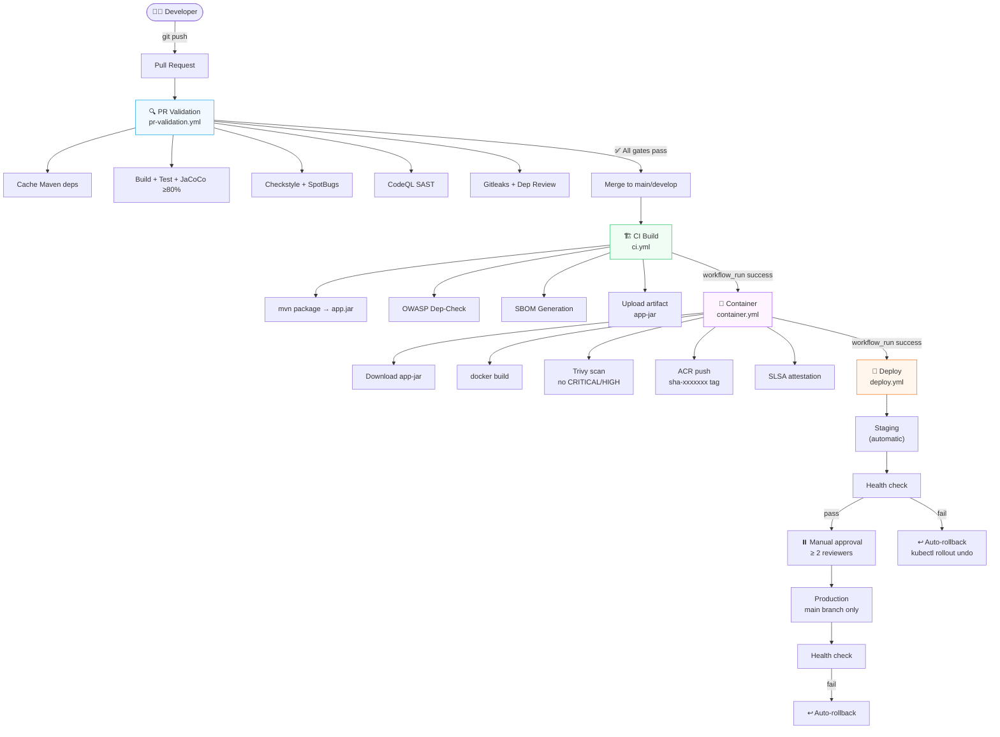
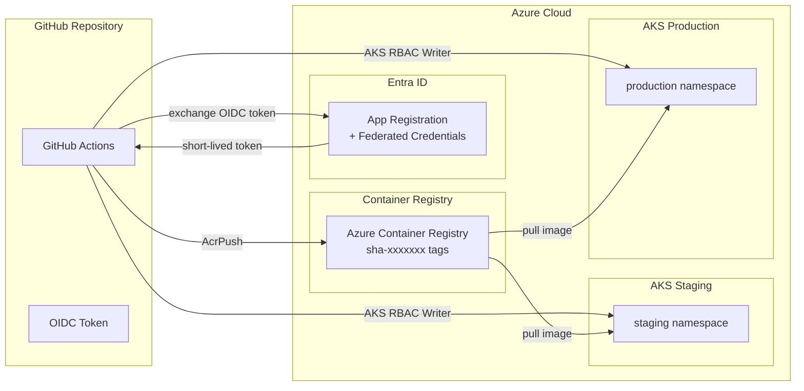

# Hello Java Maven

[](https://github.com/paloitmbb/mbb-java-maven/actions/workflows/ci.yml)
[](https://github.com/paloitmbb/mbb-java-maven/actions/workflows/container.yml)
[](https://github.com/paloitmbb/mbb-java-maven/actions/workflows/pr-validation.yml)
[](https://openjdk.org/projects/jdk/11/)
[](https://maven.apache.org/)
[](LICENSE)

A **Java 11 Maven application** paired with a production-grade CI/CD pipeline on GitHub Actions — covering code quality, security scanning, container building, and automated deployment to **Azure Kubernetes Service (AKS)**.

The application itself is deliberately minimal (a `HelloWorld` class) so the focus stays on the **pipeline architecture**: how a commit travels from a developer's branch all the way to a live Kubernetes workload with zero stored credentials and automatic rollback on failure.

> **Purpose**: This repository serves as a reference implementation and template for production-ready Java CI/CD on GitHub Actions + Azure.

---

## Table of Contents

- [Features](#features)
- [Architecture Overview](#architecture-overview)
- [Getting Started](#getting-started)
  - [Prerequisites](#prerequisites)
  - [Quick Start (Local)](#quick-start-local)
  - [Dev Container (Recommended)](#dev-container-recommended)
- [Project Structure](#project-structure)
- [Application](#application)
- [CI/CD Pipeline](#cicd-pipeline)
  - [Pipeline Flow](#pipeline-flow)
  - [Workflow Reference](#workflow-reference)
- [Quality Gates](#quality-gates)
- [Docker Image](#docker-image)
- [Azure Setup](#azure-setup)
  - [OIDC Authentication](#oidc-authentication)
  - [Required Secrets & Variables](#required-secrets--variables)
- [Development Workflow](#development-workflow)
- [Technology Stack](#technology-stack)
- [Contributing](#contributing)
- [Resources](#resources)

---

## Features

| Category | Capability |
|---|---|
| 🔨 **Build** | Java 11, Maven 3.8, JUnit 4, JaCoCo coverage (≥ 80%) |
| 🛡️ **Code Quality** | Checkstyle (Google style), SpotBugs — zero violations required |
| 🔒 **Security Scanning** | CodeQL SAST, OWASP Dependency-Check (CVSS ≥ 7 blocks), Trivy container scan, Gitleaks |
| 📦 **Build-Once** | JAR compiled once in CI, the same artifact flows through every subsequent stage |
| 🐳 **Container** | `eclipse-temurin:21-jre-alpine`, non-root UID 1001, read-only JAR, health check |
| 🧾 **Supply Chain** | SLSA provenance attestation, SPDX SBOM generation |
| 🚀 **Deployment** | Automatic staging, manual approval gate for production (≥ 2 reviewers) |
| ↩️ **Rollback** | `kubectl rollout undo` fires automatically on any deployment failure |
| 🔑 **Auth** | OIDC workload identity federation — no stored service principal secrets |
| 🤖 **Dependabot** | Automated dependency and GitHub Actions version updates |

---

## Architecture Overview

### CI/CD Pipeline Architecture



### Azure Infrastructure



---

## Getting Started

### Prerequisites

| Requirement | Version | Purpose |
|---|---|---|
| Java | 11+ | `maven.compiler.source/target = 11` |
| Maven | 3.8+ | Build, test, quality gates |
| Docker | Any recent | Local image builds |
| Azure subscription | — | ACR + AKS for full pipeline |
| GitHub Advanced Security | — | CodeQL and secret scanning |

> For the complete one-time Azure and GitHub setup, see [docs/cicd-prerequisites.md](docs/cicd-prerequisites.md).

### Quick Start (Local)

**1. Clone and run full validation:**

```bash
git clone https://github.com/paloitmbb/mbb-java-maven.git
cd mbb-java-maven
mvn clean verify
```

This single command runs: compilation → unit tests → JaCoCo coverage → Checkstyle → SpotBugs. If it passes locally, it will pass in CI.

**2. Run the application:**

```bash
mvn package -DskipTests
java -jar target/hello-java-*.jar
```

Expected output:
```
Hello, World!
This is a test Java Maven project for CI/CD pipeline testing.
```

**3. Run tests only:**

```bash
mvn test
```

**4. View coverage report:**

```bash
mvn verify
# then open in browser:
open target/site/jacoco/index.html   # macOS
xdg-open target/site/jacoco/index.html  # Linux
```

### Dev Container (Recommended)

This repository ships a [Dev Container](https://containers.dev/) for a zero-setup development environment with Java 21 runtime, VS Code extensions, and format-on-save pre-configured.

**Requirements:** VS Code + [Dev Containers extension](https://marketplace.visualstudio.com/items?itemName=ms-vscode-remote.remote-containers), or [GitHub Codespaces](https://github.com/features/codespaces).

**Steps:**
1. Open the repository in VS Code
2. Click **Reopen in Container** when prompted (or `Ctrl+Shift+P` → `Dev Containers: Reopen in Container`)
3. Maven dependencies are pre-downloaded automatically on first start

> **Note**: The Dev Container runs Java 21 for tooling, but compilation targets Java 11. Do not use Java 14+ language features.

---

## Project Structure

```
mbb-java-maven/
├── 📄 Dockerfile                         # Runtime-only image (no build step — build-once)
├── 📄 pom.xml                            # Maven build, plugins, quality gates
├── src/
│   ├── main/java/com/example/
│   │   └── HelloWorld.java              # Application entry point + greeting logic
│   └── test/java/com/example/
│       └── HelloWorldTest.java          # JUnit 4 unit tests (7 test cases)
├── docs/
│   ├── cicd-pipeline-guide.md           # Plain-English pipeline walkthrough
│   └── cicd-prerequisites.md            # One-time Azure + GitHub setup guide
├── spec/                                # Workflow specification documents
│   ├── spec-process-cicd-ci.md
│   ├── spec-process-cicd-container.md
│   ├── spec-process-cicd-deploy.md
│   └── spec-process-cicd-pr-validation.md
├── .devcontainer/
│   └── devcontainer.json                # Dev Container config (Java 21, VS Code)
└── .github/
    ├── workflows/
    │   ├── pr-validation.yml            # PR quality gates (fast feedback)
    │   ├── ci.yml                       # Build JAR, OWASP, SBOM  [name: "CI"]
    │   ├── container.yml                # Docker build, Trivy, ACR push  [name: "Container"]
    │   └── deploy.yml                   # AKS staging → production
    ├── dependabot.yml                   # Automated Maven + Actions updates
    ├── agents/                          # Copilot agent definitions
    ├── instructions/                    # Copilot coding guidelines
    └── plans/                           # Pipeline implementation plans
```

---

## Application

The application is a minimal Java class with a `main` entry point and a reusable greeting method. It is intentionally simple so all engineering attention stays on the pipeline.

### `HelloWorld.java`

```java
public class HelloWorld {

    public static void main(String[] args) {
        System.out.println("Hello, World!");
        System.out.println("This is a test Java Maven project for CI/CD pipeline testing.");
    }

    /**
     * Returns a greeting message.
     * @param name the name to greet; returns "Hello, World!" if null or empty
     * @return greeting message
     */
    public String getGreeting(String name) {
        if (name == null || name.isEmpty()) {
            return "Hello, World!";
        }
        return "Hello, " + name + "!";
    }
}
```

### Test Coverage

7 unit tests covering all paths in `getGreeting()` and `main()`:

| Test | Scenario |
|---|---|
| `testGetGreetingWithName` | Standard name input |
| `testGetGreetingWithNull` | Null guard check |
| `testGetGreetingWithEmptyString` | Empty string guard |
| `testGetGreetingWithWhitespace` | Whitespace-only name |
| `testGetGreetingWithSpecialCharacters` | Special chars in name |
| `testGetGreetingWithLongName` | Long string handling |
| `testMainMethod` | `main()` stdout verification |

---

## CI/CD Pipeline

### Pipeline Flow

```
┌─────────────────────────────────────────────────────────────────────────┐
│  TRIGGER: Pull Request to main / develop                                │
├─────────────────────────────────────────────────────────────────────────┤
│  pr-validation.yml                                                      │
│  ├─ setup-cache          Pre-download Maven deps (shared across jobs)   │
│  ├─ build-and-test       Compile, test, JaCoCo ≥ 80%                   │
│  ├─ code-quality         Checkstyle (Google) + SpotBugs                 │
│  ├─ codeql               GitHub SAST (Java)                             │
│  ├─ secrets-scan         Gitleaks — full git history                    │
│  └─ dependency-review    Block new HIGH/CRITICAL CVE deps               │
└───────────────────────────┬─────────────────────────────────────────────┘
                            │ merge to main/develop
┌───────────────────────────▼─────────────────────────────────────────────┐
│  ci.yml  [name: "CI"]                                                   │
│  ├─ build-and-package    mvn package → app.jar artifact                 │
│  ├─ security-gate        OWASP Dep-Check (blocks CVSS ≥ 7)             │
│  ├─ sbom                 SPDX SBOM generation                           │
│  └─ codeql               GitHub SAST (full analysis)                    │
└───────────────────────────┬─────────────────────────────────────────────┘
                            │ workflow_run: CI ✅
┌───────────────────────────▼─────────────────────────────────────────────┐
│  container.yml  [name: "Container"]                                     │
│  ├─ build-image          docker build (downloads app-jar artifact)      │
│  ├─ scan-image           Trivy — blocks CRITICAL/HIGH CVEs              │
│  └─ attest-and-push      ACR push (sha-xxxxxxx), SLSA attestation      │
└───────────────────────────┬─────────────────────────────────────────────┘
                            │ workflow_run: Container ✅
┌───────────────────────────▼─────────────────────────────────────────────┐
│  deploy.yml                                                             │
│  ├─ deploy-staging       kubectl apply → AKS staging (automatic)        │
│  │   └─ health-check     GET /actuator/health — rollback on failure     │
│  └─ deploy-production    Manual approval ≥ 2 reviewers (main only)      │
│      └─ health-check     GET /actuator/health — rollback on failure     │
└─────────────────────────────────────────────────────────────────────────┘
```

> [!IMPORTANT]
> The `workflow_run` trigger chain depends on **exact workflow names**. `ci.yml` must have `name: CI` and `container.yml` must have `name: Container`. Renaming either file's `name:` field silently breaks the entire downstream pipeline.

### Workflow Reference

| Workflow | Trigger | `cancel-in-progress` | Key outputs |
|---|---|---|---|
| `pr-validation.yml` | PR to `main`/`develop` | `true` (superseded by new pushes) | Test + quality reports |
| `ci.yml` | Push to `main`/`develop` | `false` (artifact must complete) | `app-jar` artifact |
| `container.yml` | `CI` workflow completes | `true` (safe — image build) | `deploy-metadata` artifact, ACR image |
| `deploy.yml` | `Container` workflow completes | `false` ⚠️ (interrupting kubectl corrupts pods) | Deployed revision |

For a plain-English walkthrough of every job and step, see [docs/cicd-pipeline-guide.md](docs/cicd-pipeline-guide.md).

---

## Quality Gates

Every gate is a **hard build failure** — the workflow does not proceed if any gate fails.

| Gate | Tool | Threshold | Enforced in |
|---|---|---|---|
| Line coverage | JaCoCo | ≥ 80% | PR Validation, CI |
| Code style | Checkstyle 10.13.0 | Zero violations (Google checks) | PR Validation |
| Bug analysis | SpotBugs 4.8.3 | Zero violations | PR Validation |
| Vulnerability scan | OWASP Dep-Check | No CVE with CVSS ≥ 7 | CI |
| Secret detection | Gitleaks | No secrets in git history | PR Validation |
| New dep CVEs | GitHub Dep Review | No HIGH/CRITICAL on new deps | PR Validation |
| Container CVEs | Trivy | No CRITICAL or HIGH in image | Container |

---

## Docker Image

### Build-Once Principle

The JAR is **compiled once** in `ci.yml` and stored as a GitHub Actions artifact. The `container.yml` workflow downloads that exact artifact and copies it into the image — **no Maven or JDK is present in the container**.

```
CI (mvn package)           Container (docker build)
─────────────────          ────────────────────────
hello-java-*.jar ──copy──▶ app.jar
         ↓                        ↓
   upload artifact          COPY target/app.jar
```

### Image Specification

| Property | Value |
|---|---|
| Base image | `eclipse-temurin:21-jre-alpine` |
| User | `appuser` (UID 1001, non-root) |
| Working directory | `/app` |
| JAR permissions | `440` (read-only, owned by appuser) |
| Exposed port | `8080` |
| JVM flags | `+UseContainerSupport`, `MaxRAMPercentage=75.0` |
| Health check | `wget` → `localhost:8080/actuator/health` (30s interval) |
| Image tag format | `sha-<7-char-commit-sha>` — `:latest` is never used |

```dockerfile
FROM eclipse-temurin:21-jre-alpine

ARG APP_VERSION=unknown
ARG BUILD_DATE=unknown

RUN addgroup -g 1001 appgroup && \
    adduser -u 1001 -G appgroup -D -h /app appuser
WORKDIR /app
COPY target/app.jar /app/app.jar
RUN chown appuser:appgroup /app/app.jar && chmod 440 /app/app.jar
USER appuser
EXPOSE 8080

ENV JAVA_OPTS="-XX:+UseContainerSupport -XX:MaxRAMPercentage=75.0 \
    -Djava.security.egd=file:/dev/./urandom"

HEALTHCHECK --interval=30s --timeout=5s --start-period=60s --retries=3 \
    CMD wget -qO- http://localhost:8080/actuator/health || exit 1

ENTRYPOINT ["sh", "-c", "exec java $JAVA_OPTS -jar /app/app.jar"]
```

---

## Azure Setup

### OIDC Authentication

The pipeline uses **OIDC workload identity federation** — no service principal passwords are stored anywhere. GitHub exchanges a short-lived JWT for Azure access tokens at runtime.

```
GitHub Actions runner
        │
        │  POST /token  (OIDC JWT)
        ▼
Azure Entra ID App Registration
        │  ← Federated credentials trust:
        │     repo:paloitmbb/mbb-java-maven:ref:refs/heads/main
        │     repo:paloitmbb/mbb-java-maven:ref:refs/heads/develop
        │     repo:paloitmbb/mbb-java-maven:environment:production
        │
        │  Returns short-lived access token
        ▼
Azure Resources (scoped RBAC)
  ├── ACR          ← AcrPush role
  ├── AKS Staging  ← AKS Cluster User + AKS RBAC Writer
  └── AKS Prod     ← AKS Cluster User + AKS RBAC Writer
```

### Required Secrets & Variables

**GitHub Secrets** (`Settings → Secrets and variables → Actions`):

| Secret | Description |
|---|---|
| `AZURE_CLIENT_ID` | App Registration (service principal) client ID |
| `AZURE_TENANT_ID` | Azure Entra ID tenant ID |
| `AZURE_SUBSCRIPTION_ID` | Azure subscription ID |
| `GITLEAKS_LICENSE` | Gitleaks license key (private repos only) |

**GitHub Variables** (`Settings → Secrets and variables → Actions → Variables`):

| Variable | Example value | Description |
|---|---|---|
| `ACR_LOGIN_SERVER` | `myregistry.azurecr.io` | Container Registry login URL |
| `ACR_REPOSITORY` | `myapp` | Repository name inside ACR |
| `APP_NAME` | `myapp` | Kubernetes deployment name |
| `AKS_CLUSTER_NAME_STAGING` | `aks-staging` | AKS staging cluster name |
| `AKS_RESOURCE_GROUP_STAGING` | `rg-staging` | Staging cluster resource group |
| `AKS_CLUSTER_NAME_PROD` | `aks-prod` | AKS production cluster name |
| `AKS_RESOURCE_GROUP_PROD` | `rg-prod` | Production cluster resource group |
| `STAGING_HEALTH_URL` | `https://staging.myapp.example.com` | Health check endpoint (staging) |
| `PRODUCTION_HEALTH_URL` | `https://myapp.example.com` | Health check endpoint (production) |

> [!NOTE]
> The full step-by-step setup guide — including Kubernetes namespace creation, Ingress configuration, and GitHub environment protection rules — is in [docs/cicd-prerequisites.md](docs/cicd-prerequisites.md).

---

## Development Workflow

### Maven Commands

```bash
# Full validation — mirrors exactly what CI runs (run this before every commit)
mvn clean verify

# Fast test feedback during development
mvn test

# Build JAR without running tests (not for CI)
mvn package -DskipTests

# Pre-download all dependencies (useful in Dev Container / offline environments)
mvn dependency:resolve

# View dependency tree
mvn dependency:tree
```

### Branch Strategy

| Branch | Deploys to | Notes |
|---|---|---|
| `feature/*` | ❌ No deployment | PR validation only |
| `develop` | ✅ Staging (automatic) | Integration testing target |
| `main` | ✅ Staging → ✅ Production | Production requires ≥ 2 approvers |

### Pre-Commit Checklist

Before opening a PR, ensure:

- [ ] `mvn clean verify` passes locally (zero Checkstyle/SpotBugs violations, ≥ 80% coverage)
- [ ] No secrets committed (`git log --all` reviewed)
- [ ] New public methods have Javadoc with `@param` and `@return`
- [ ] Tests cover the happy path, null input, and edge cases for any new logic

---

## Technology Stack

### Application & Build

| Component | Version | Role |
|---|---|---|
| Java (source/target) | **11** | Language and bytecode target |
| Maven Compiler Plugin | 3.8.1 | Compilation |
| Maven Surefire Plugin | 2.22.2 | Test runner (JUnit 4 compatible) |
| JUnit | 4.13.2 | Unit testing framework |
| JaCoCo Maven Plugin | 0.8.11 | Code coverage (≥ 80% gate) |
| Checkstyle + Plugin | 10.13.0 / 3.3.1 | Style enforcement (Google checks) |
| SpotBugs Maven Plugin | 4.8.3.0 | Static bug analysis |

### Container & Infrastructure

| Component | Version / Value | Role |
|---|---|---|
| Base image | `eclipse-temurin:21-jre-alpine` | Minimal JRE runtime |
| Dev Container base | `mcr.microsoft.com/devcontainers/java:1-21-bookworm` | Local development |
| Azure Container Registry | — | Image storage |
| Azure Kubernetes Service | — | Container orchestration |
| GitHub Actions | — | CI/CD orchestration |

---

## Contributing

1. **Fork** the repository and create a feature branch from `develop`:
   ```bash
   git checkout -b feature/your-feature develop
   ```

2. **Implement** your changes following the coding guidelines in `.github/instructions/`.

3. **Validate** locally before pushing:
   ```bash
   mvn clean verify
   ```

4. **Open a Pull Request** targeting `develop`. The PR validation workflow runs automatically.

5. **Address** any gate failures (coverage, Checkstyle, SpotBugs) before requesting review.

6. **Review** — all blocking comments must be resolved before merge.

> For detailed coding standards, see `.github/instructions/java.instructions.md`.  
> For commit message format, see `.github/instructions/git.instructions.md`.

---

## Resources

### Project Documentation

| Document | Description |
|---|---|
| [CI/CD Pipeline Guide](docs/cicd-pipeline-guide.md) | Plain-English walkthrough of every workflow, job, and step |
| [CI/CD Prerequisites](docs/cicd-prerequisites.md) | One-time Azure + GitHub setup guide |
| [Project Structure Blueprint](Project_Folders_Structure_Blueprint.md) | Full directory layout and file placement guide |

### External References

| Resource | Link |
|---|---|
| Eclipse Temurin Docker images | https://hub.docker.com/_/eclipse-temurin |
| GitHub Actions `workflow_run` trigger | https://docs.github.com/en/actions/using-workflows/events-that-trigger-workflows#workflow_run |
| Azure Workload Identity Federation | https://learn.microsoft.com/en-us/entra/workload-id/workload-identity-federation |
| SLSA provenance specification | https://slsa.dev/spec/v1.0/provenance |
| OWASP Dependency-Check | https://owasp.org/www-project-dependency-check/ |
| Trivy container scanner | https://trivy.dev/ |

---

## License

This project is licensed under the [MIT License](LICENSE).
