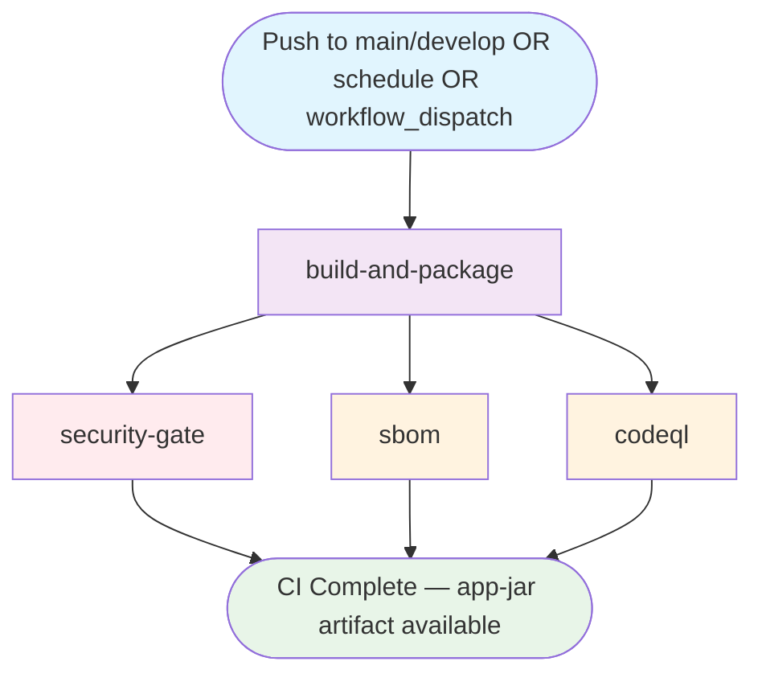

## Workflow Overview

**Purpose**: Build, test, package, and security-scan the application on every push to `main`/`develop`; produce the `app-jar` artifact consumed by the Container workflow.
**Trigger Events**: Push to `main` or `develop`; `workflow_dispatch`; weekly schedule (Sunday 21:00 UTC)
**Target Environments**: CI runner (no deployment)
**Workflow File**: `.github/workflows/ci.yml`
**Workflow Name (immutable)**: `CI` ← **Never rename — `container.yml` triggers on this exact name**
**Chain Position**: Link 1 of 3 — upstream of `Container` workflow

---

## Execution Flow Diagram



---

## Jobs & Dependencies

| Job Name | Purpose | Dependencies | Execution Context | Timeout |
|---|---|---|---|---|
| `build-and-package` | Full Maven lifecycle: compile → test → coverage → package; uploads `app-jar` | — | `ubuntu-latest` | 25 min |
| `security-gate` | OWASP Dependency-Check; blocks on CVSS ≥ 7; uploads SARIF | `build-and-package` | `ubuntu-latest` | 20 min |
| `sbom` | Submit dependency graph to GitHub; generate SPDX SBOM artifact | `build-and-package` | `ubuntu-latest` | 10 min |
| `codeql` | Full CodeQL SAST (security-and-quality queries) on full history | `build-and-package` | `ubuntu-latest` | 30 min |

**Concurrency**: `ci-${{ github.ref }}` — one active run per branch; `cancel-in-progress: false` (never cancel running CI).

---

## Requirements Matrix

### Functional Requirements

| ID | Requirement | Priority | Acceptance Criteria |
|---|---|---|---|
| REQ-001 | Single Maven lifecycle: `clean verify -P integration-test` builds, tests, and packages | High | One Maven invocation handles all lifecycle phases |
| REQ-002 | Integration tests run as soft gate (non-blocking) | Medium | `continue-on-error: true` on integration test step |
| REQ-003 | Line coverage ≥ 80% enforced as hard gate | High | `jacoco:check` exits non-zero below threshold |
| REQ-004 | Test results published to GitHub Checks | Medium | XML reports attached to commit status |
| REQ-005 | JAR normalized to `app.jar` before artifact upload | High | Container workflow expects `app-jar` artifact containing `app.jar` |
| REQ-006 | OWASP Dependency-Check fails on CVSS ≥ 7 | High | `-DfailBuildOnCVSS=7` causes exit non-zero |
| REQ-007 | OWASP SARIF uploaded to GitHub Security tab | Medium | `upload-sarif` runs even on failure (`if: always()`) |
| REQ-008 | SPDX SBOM generated and archived per commit SHA | Medium | Artifact named `sbom-${{ github.sha }}` |
| REQ-009 | Dependency graph submitted to GitHub | Medium | `maven-dependency-submission-action` runs post-build |
| REQ-010 | CodeQL uses full git history | Medium | `fetch-depth: 0` on codeql job checkout |
| REQ-011 | Weekly scheduled run for CodeQL drift detection | Low | `cron: '0 21 * * 0'` |

### Security Requirements

| ID | Requirement | Implementation Constraint |
|---|---|---|
| SEC-001 | No credentials persist after checkout | `persist-credentials: false` on all checkouts |
| SEC-002 | CVSS ≥ 7 dependency CVEs block build | `security-gate` job set to fail build |
| SEC-003 | OWASP and CodeQL SARIF visible in Security tab | `security-events: write` scoped to respective jobs |
| SEC-004 | SBOM archived for supply chain audit | `sbom` job generates SPDX JSON artifact per commit |
| SEC-005 | `contents: write` scoped only to `sbom` job | Required for dependency graph submission |

### Performance Requirements

| ID | Metric | Target | Measurement Method |
|---|---|---|---|
| PERF-001 | `build-and-package` duration | ≤ 25 min | Job timeout |
| PERF-002 | `security-gate` duration | ≤ 20 min | Job timeout |
| PERF-003 | Total pipeline wall-clock | ≤ 45 min | GitHub Actions run duration |
| PERF-004 | Maven cache hit rate | > 80% | `cache: maven` restore logs |

---

## Input/Output Contracts

### Inputs

```yaml
# GitHub Events
triggers:
  push:
    branches: [main, develop]
  workflow_dispatch: {}
  schedule:
    - cron: '0 21 * * 0'   # Weekly Sunday 21:00 UTC

# Source code: src/main/java/**/*.java
# Build config: pom.xml
```

### Outputs

```yaml
# Critical Artifact (consumed by container.yml)
app-jar:
  path: target/app.jar
  retention: 3 days
  on-missing: error   # Hard failure if JAR not found

# Supporting Artifacts
test-reports:
  path: target/surefire-reports/
  retention: 7 days
coverage-report:
  path: target/site/jacoco/
  retention: 7 days
dependency-check-report:
  path: target/dependency-check-report.*
  retention: 30 days
sbom-{sha}:
  format: SPDX JSON
  retention: per anchore/sbom-action default

# GitHub Security Tab
owasp-dependency-check: SARIF category
codeql: SARIF category  (/language:java)

# GitHub Dependency Graph
dependency-submission: submitted via maven-dependency-submission-action
```

### Secrets & Variables

| Type | Name | Purpose | Scope |
|---|---|---|---|
| Built-in | `GITHUB_TOKEN` | Checks API, SARIF upload, artifact download | All jobs |

---

## Execution Constraints

### Runtime Constraints

- **Max single-job timeout**: 30 min (`codeql`)
- **Concurrency group**: `ci-${{ github.ref }}`
- **Cancel policy**: `cancel-in-progress: false` — running CI must complete
- **Workflow-level permissions**: `contents: read` (overridden per job as needed)

### Environmental Constraints

- **Runner**: `ubuntu-latest`
- **Java**: JDK 21 (Temurin) — devcontainer and CI runtime
- **Compilation target**: Java 11 (enforced in `pom.xml`)
- **Build tool**: Maven (with cache)

### Permissions (Minimum Required)

| Job | Required Permissions |
|---|---|
| `build-and-package` | `contents: read`, `checks: write` |
| `security-gate` | `contents: read`, `security-events: write` |
| `sbom` | `contents: write` (dependency graph submission) |
| `codeql` | `contents: read`, `security-events: write`, `actions: read` |

---

## Error Handling Strategy

| Error Type | Response | Recovery Action |
|---|---|---|
| Test failure | `build-and-package` fails; reports still uploaded | Fix failing tests |
| Coverage < 80% | `jacoco:check` exits non-zero; build fails | Increase test coverage |
| Integration test failure | `continue-on-error: true` — soft gate, logged only | Review integration failures separately |
| CVSS ≥ 7 CVE detected | `security-gate` fails; SARIF uploaded regardless | Upgrade or exclude vulnerable dependency |
| OWASP report upload failure | `if: always()` ensures SARIF always uploaded | Check Security tab for partial results |
| JAR normalization failure | `if-no-files-found: error` on artifact upload | Investigate Maven packaging step |
| CodeQL failure | Build continues (advisory); SARIF uploaded | Review Security tab |
| SBOM generation failure | `sbom` job fails; does not block `security-gate` or `codeql` | Investigate SBOM action |

---

## Quality Gates

| Gate | Criteria | Bypass Conditions |
|---|---|---|
| Unit Tests | All pass | None |
| Integration Tests | Soft gate — logged but non-blocking | `continue-on-error: true` |
| Line Coverage | ≥ 80% (JaCoCo hard gate) | None |
| OWASP CVEs | CVSS < 7 for all dependencies | None |
| CodeQL SAST | Advisory (uploaded to Security tab) | None — but non-blocking |
| JAR Availability | `app.jar` must exist in `target/` | None — build fails if absent |

---

## Monitoring & Observability

### Key Metrics

- **Success Rate**: Target ≥ 98% of pushes to `main`/`develop`
- **Execution Time**: Target ≤ 45 min total wall-clock
- **OWASP Report Age**: Weekly scheduled run revalidates dependency landscape

### Alerting

| Condition | Severity | Notification Target |
|---|---|---|
| CVSS ≥ 7 CVE found | High | Build failure + SARIF in Security tab |
| Coverage drops below 80% | High | Build failure notification |
| Weekly scheduled scan failure | Medium | Repository owner notification |

---

## Integration Points

### External Systems

| System | Integration Type | Data Exchange | SLA Requirements |
|---|---|---|---|
| GitHub Checks API | Write | Test result XML → commit status | Synchronous |
| GitHub Security Tab | Write (SARIF) | OWASP + CodeQL alerts | On run completion |
| GitHub Dependency Graph | Write | Maven BOM snapshot | Post-build |
| OWASP NVD Feed | Read | CVE database fetch | Network access required |

### Dependent Workflows

| Workflow | Relationship | Trigger Mechanism |
|---|---|---|
| `Container` (`container.yml`) | Downstream consumer | `workflow_run: workflows: ['CI']` |

---

## Compliance & Governance

### Audit Requirements

- **OWASP Reports**: Retained 30 days as artifact
- **SBOM**: Archived per commit SHA for supply chain traceability
- **Dependency Graph**: Submitted to GitHub for Dependabot alerting
- **Approval Gates**: None on CI (gated by PR Validation before merge)

### Security Controls

- **Credential Isolation**: `persist-credentials: false` everywhere
- **Least Privilege**: `contents: write` scoped only to `sbom` job
- **Attestation Foundation**: `app-jar` artifact feeds into SLSA provenance in `container.yml`

---

## Edge Cases & Exceptions

| Scenario | Expected Behavior | Validation Method |
|---|---|---|
| Push with no Java changes | All jobs still run (no path filters) | Verify on docs-only push |
| OWASP NVD feed unreachable | `security-gate` may fail or produce incomplete report | Retry; check NVD status |
| JAR has unexpected name pattern | `ls target/*.jar | grep -v original` must match exactly one file | Verify build produces single JAR |
| Weekly schedule on inactive repo | Runs normally — detects new CVEs even without code changes | Check Actions schedule tab |
| `workflow_dispatch` on branch | Runs full pipeline; `security-gate` and `sbom` run in parallel | Manual trigger test |

---

## Validation Criteria

- **VLD-001**: Workflow `name:` must be exactly `CI` (not `CI Pipeline`, `Main CI`, etc.)
- **VLD-002**: `app-jar` artifact must use `if-no-files-found: error`
- **VLD-003**: `security-gate` and `sbom` and `codeql` must all have `needs: [build-and-package]`
- **VLD-004**: OWASP SARIF uploaded with `if: always()`
- **VLD-005**: `cancel-in-progress: false` — CI runs must not be interrupted
- **VLD-006**: CodeQL checkout uses `fetch-depth: 0`
- **VLD-007**: Integration test step has `continue-on-error: true`
- **VLD-008**: JAR normalized to `app.jar` before upload

---

## Change Management

### Update Process

1. **Specification Update**: Modify this document first
2. **Name Change Impact**: If `name: CI` must change, update `container.yml` `workflows: ['CI']` simultaneously
3. **Review & Approval**: PR review by DevOps Team
4. **Implementation**: Apply changes; verify artifact names unchanged
5. **Testing**: Push to `develop`, confirm all 4 jobs pass and `app-jar` artifact created

### Version History

| Version | Date | Changes | Author |
|---|---|---|---|
| 1.0 | 2026-03-05 | Initial specification | DevOps Team |

---

## Related Specifications

- [spec-process-cicd-pr-validation.md](spec-process-cicd-pr-validation.md) — Pre-merge validation
- [spec-process-cicd-container.md](spec-process-cicd-container.md) — Downstream: Docker build & scan
- [spec-process-cicd-deploy.md](spec-process-cicd-deploy.md) — Final: AKS deployment
