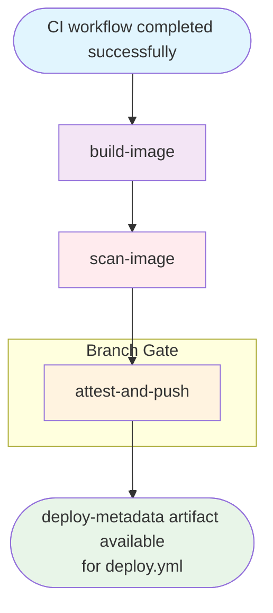

## Workflow Overview

**Purpose**: Build a Docker image from the pre-built JAR artifact, scan it for vulnerabilities, attach SLSA provenance attestation, and push it to Azure Container Registry with an immutable SHA-only tag.
**Trigger Events**: Successful completion of CI workflow (`workflow_run`); `workflow_dispatch`
**Target Environments**: Azure Container Registry (ACR) — staging/production feed
**Workflow File**: `.github/workflows/container.yml`
**Workflow Name (immutable)**: `Container` ← **Never rename — `deploy.yml` triggers on this exact name**
**Chain Position**: Link 2 of 3 — downstream of `CI`, upstream of `Deploy`

---

## Execution Flow Diagram



---

## Jobs & Dependencies

| Job Name | Purpose | Dependencies | Execution Context | Timeout |
|---|---|---|---|---|
| `build-image` | Download `app-jar`; build Docker image; save as tarball artifact | — (but requires CI success) | `ubuntu-latest` | 15 min |
| `scan-image` | Load image tarball; run Trivy; fail on CRITICAL/HIGH; upload SARIF | `build-image` | `ubuntu-latest` | 15 min |
| `attest-and-push` | Load image; OIDC login to Azure; push with SHA tag; generate SLSA attestation; export `deploy-metadata` | `scan-image` | `ubuntu-latest` | 15 min |

**Concurrency**: `container-${{ github.event.workflow_run.head_branch }}` — one active run per branch; `cancel-in-progress: true`.

---

## Requirements Matrix

### Functional Requirements

| ID | Requirement | Priority | Acceptance Criteria |
|---|---|---|---|
| REQ-001 | JAR artifact fetched from upstream CI run — no Maven rebuild | High | `run-id: ${{ github.event.workflow_run.id }}` on download step |
| REQ-002 | Docker image built without push (tarball output) | High | `push: false`; `outputs: type=docker,dest=/tmp/image.tar` |
| REQ-003 | Docker layer cache shared across runs | Medium | `cache-from/cache-to: type=gha` |
| REQ-004 | Trivy exits non-zero on any CRITICAL or HIGH CVE | High | `exit-code: '1'`; `severity: CRITICAL,HIGH` |
| REQ-005 | Unfixed CVEs ignored in Trivy scan | Medium | `ignore-unfixed: true` |
| REQ-006 | Trivy SARIF uploaded to Security tab even on failure | High | `upload-sarif` step has `if: always()` |
| REQ-007 | Azure login uses OIDC — no stored credentials | High | `azure/login@v2` with `client-id`, `tenant-id`, `subscription-id` |
| REQ-008 | Image tagged with immutable commit SHA only | High | Tag format: `{ACR_LOGIN_SERVER}/{ACR_REPOSITORY}:{COMMIT_SHA}` |
| REQ-009 | SLSA Level 2 provenance attestation generated and pushed | High | `actions/attest-build-provenance@v2` with digest |
| REQ-010 | `deploy-metadata` artifact contains `commit-sha`, `image-tag`, `image-digest` | High | Three separate files in single artifact |
| REQ-011 | `attest-and-push` restricted to `main` and `develop` branches | High | Branch gate condition in job `if:` |
| REQ-012 | COMMIT_SHA resolved from `workflow_run.head_sha` not `github.sha` | High | `env.COMMIT_SHA: ${{ github.event.workflow_run.head_sha \|\| github.sha }}` |

### Security Requirements

| ID | Requirement | Implementation Constraint |
|---|---|---|
| SEC-001 | No credentials stored; Azure login via OIDC only | `id-token: write` permission; no password/PAT |
| SEC-002 | No CRITICAL or HIGH CVEs allowed in final image | Trivy hard gate; build fails if found |
| SEC-003 | Image tag is commit SHA — no mutable `:latest` | Tag derived from `COMMIT_SHA` env var |
| SEC-004 | SLSA provenance attestation links image to workflow run | `attest-build-provenance` with digest |
| SEC-005 | `attestations: write` scoped only to `attest-and-push` job | Minimal permission scope |
| SEC-006 | Container image tarball has 1-day retention | Ephemeral; not intended for long-term storage |

### Performance Requirements

| ID | Metric | Target | Measurement Method |
|---|---|---|---|
| PERF-001 | `build-image` duration | ≤ 15 min | Job timeout |
| PERF-002 | Docker build cache hit rate | > 50% on re-runs | GHA cache usage metrics |
| PERF-003 | Total pipeline wall-clock | ≤ 45 min (from CI trigger) | GitHub Actions run duration |

---

## Input/Output Contracts

### Inputs

```yaml
# Upstream Trigger
trigger: workflow_run
workflows: ['CI']       # CRITICAL: must match ci.yml name exactly
types: [completed]
branches: [main, develop]

# Workflow-level Environment
COMMIT_SHA: ${{ github.event.workflow_run.head_sha || github.sha }}

# Consumed Artifact (from CI run)
app-jar:
  path: target/app.jar
  run-id: github.event.workflow_run.id    # Cross-workflow download
  github-token: GITHUB_TOKEN
```

### Outputs

```yaml
# Pushed to ACR
image:
  registry: vars.ACR_LOGIN_SERVER
  repository: vars.ACR_REPOSITORY
  tag: COMMIT_SHA                          # Immutable SHA tag
  attestation: SLSA Level 2 provenance

# Artifact consumed by deploy.yml
deploy-metadata:
  files:
    - commit-sha    # Raw COMMIT_SHA string
    - image-tag     # Full image reference e.g. registry.azurecr.io/app:sha-abc123
    - image-digest  # sha256:... digest
  retention: 7 days

# GitHub Security Tab
trivy-container: SARIF category

# In-workflow artifact (ephemeral)
container-image:
  path: /tmp/image.tar
  retention: 1 day
```

### Secrets & Variables

| Type | Name | Purpose | Scope |
|---|---|---|---|
| Secret | `AZURE_CLIENT_ID` | OIDC federated identity | `attest-and-push` job |
| Secret | `AZURE_TENANT_ID` | OIDC tenant | `attest-and-push` job |
| Secret | `AZURE_SUBSCRIPTION_ID` | Azure subscription scope | `attest-and-push` job |
| Variable | `ACR_LOGIN_SERVER` | ACR hostname (e.g. `myregistry.azurecr.io`) | `attest-and-push` job |
| Variable | `ACR_REPOSITORY` | Image name within ACR | `attest-and-push` job |
| Built-in | `GITHUB_TOKEN` | Cross-workflow artifact download | `build-image` job |

---

## Execution Constraints

### Runtime Constraints

- **Max single-job timeout**: 15 min (all jobs)
- **Concurrency group**: `container-${{ github.event.workflow_run.head_branch || github.ref }}`
- **Cancel policy**: `cancel-in-progress: true` (image builds can be cancelled; pushes protected by branch gate)
- **Top-level condition**: `github.event.workflow_run.conclusion == 'success' || github.event_name == 'workflow_dispatch'`

### Environmental Constraints

- **Runner**: `ubuntu-latest` (Docker available)
- **Azure OIDC**: Federated credential must be configured in Azure AD app registration
- **ACR Access**: Push permission to ACR repository
- **Network**: Docker Hub (base image pull), ACR push, SLSA attestation API

### Permissions (Minimum Required)

| Job | Required Permissions |
|---|---|
| `build-image` | `contents: read`, `actions: read` |
| `scan-image` | `contents: read`, `security-events: write` |
| `attest-and-push` | `contents: read`, `id-token: write`, `attestations: write` |

---

## Error Handling Strategy

| Error Type | Response | Recovery Action |
|---|---|---|
| CI workflow failed | Entire Container workflow skipped (top-level condition) | Fix CI, re-push |
| JAR artifact not found | `build-image` fails (artifact download exits non-zero) | Verify CI `app-jar` artifact exists |
| Docker build failure | `build-image` fails; no tarball uploaded | Fix Dockerfile |
| Trivy CRITICAL/HIGH CVE | `scan-image` fails; SARIF uploaded regardless | Upgrade base image or fix vulnerability |
| Azure OIDC auth failure | `attest-and-push` fails at login step | Verify federated credentials configured |
| ACR push failure | `attest-and-push` fails; no image published | Check ACR permissions and connectivity |
| SLSA attestation failure | `attest-and-push` fails; image already pushed | Re-run job; verify `attestations: write` |
| Wrong COMMIT_SHA (github.sha fallback) | Image tagged with default branch SHA in `workflow_run` context | Always set `workflow_run.head_sha` as primary |

---

## Quality Gates

| Gate | Criteria | Bypass Conditions |
|---|---|---|
| Upstream CI Success | CI workflow must conclude `success` | `workflow_dispatch` manual override |
| Trivy Scan | No CRITICAL or HIGH CVEs (fixed) | `ignore-unfixed: true` exempts unfixable |
| Branch Gate (push) | `attest-and-push` restricted to `main`/`develop` | `workflow_dispatch` override |
| SLSA Attestation | Provenance must be generated and pushed | None |

---

## Monitoring & Observability

### Key Metrics

- **Success Rate**: Target ≥ 98% after CI success
- **Execution Time**: Target ≤ 35 min total (build + scan + push)
- **Trivy SARIF Freshness**: Uploaded on every run regardless of pass/fail

### Alerting

| Condition | Severity | Notification Target |
|---|---|---|
| CRITICAL/HIGH CVE in image | High | Build failure + SARIF in Security tab |
| ACR push failure | High | Build failure notification |
| OIDC auth failure | Critical | Ops team (identity misconfiguration) |

---

## Integration Points

### External Systems

| System | Integration Type | Data Exchange | SLA Requirements |
|---|---|---|---|
| Azure Container Registry | Write | Docker image push | < 5 min push time |
| Azure Active Directory (OIDC) | Authentication | Short-lived JWT token | Pre-push |
| GitHub Security Tab | Write (SARIF) | Trivy vulnerability report | On run completion |
| SLSA Attestation API | Write | Provenance bundle | Post-push |

### Dependent Workflows

| Workflow | Relationship | Trigger Mechanism |
|---|---|---|
| `CI` (`ci.yml`) | Upstream trigger | `workflow_run: workflows: ['CI']` → this workflow |
| `Deploy` (`deploy.yml`) | Downstream consumer | `workflow_run: workflows: ['Container']` → deploy |

---

## Compliance & Governance

### Audit Requirements

- **Trivy Reports**: Retained 30 days as artifact
- **SLSA Attestation**: Persisted in ACR registry alongside image
- **Deploy Metadata**: Retained 7 days; links SHA → full image reference → digest
- **Approval Gates**: None (automated scan gate only)

### Security Controls

- **No Stored Credentials**: Azure access exclusively via OIDC federated identity
- **Immutable Tags**: SHA-only tags prevent image substitution attacks
- **Supply Chain Integrity**: SLSA Level 2 provenance attestation
- **Vulnerability Gate**: Trivy hard-fails on CRITICAL/HIGH (fixed) CVEs

---

## Edge Cases & Exceptions

| Scenario | Expected Behavior | Validation Method |
|---|---|---|
| `workflow_dispatch` on `feature` branch | `build-image` + `scan-image` run; `attest-and-push` skipped | Check branch gate condition |
| CI run artifact expired (> 3 days) | `build-image` fails — artifact not found | Verify CI artifact retention policy |
| Same commit pushed twice | Second Container run replaces first (concurrency cancel) | Check concurrency group behavior |
| New base image layer with CVE | `scan-image` fails; engineer must update Dockerfile | Weekly CI schedule catches drift |
| OIDC token expired mid-push | `attest-and-push` fails mid-run; image may be partially pushed | Re-run job; verify idempotency |

---

## Validation Criteria

- **VLD-001**: Workflow `name:` must be exactly `Container` (never rename)
- **VLD-002**: `workflows: ['CI']` in `on.workflow_run` must match `ci.yml` `name:` exactly
- **VLD-003**: `COMMIT_SHA` env must use `workflow_run.head_sha` (not `github.sha`)
- **VLD-004**: `build-image` uses `run-id: ${{ github.event.workflow_run.id }}` for artifact download
- **VLD-005**: Trivy has `exit-code: '1'` and `severity: CRITICAL,HIGH`
- **VLD-006**: SARIF upload has `if: always()`
- **VLD-007**: `attest-and-push` has branch condition for `main`/`develop` only
- **VLD-008**: `deploy-metadata` artifact contains all three files: `commit-sha`, `image-tag`, `image-digest`
- **VLD-009**: `cancel-in-progress: true` — stale image builds are cancelled
- **VLD-010**: Top-level `if:` checks `workflow_run.conclusion == 'success'`

---

## Change Management

### Update Process

1. **Specification Update**: Modify this document first
2. **Name Change Impact**: If `name: Container` must change, update `deploy.yml` `workflows: ['Container']` simultaneously
3. **Review & Approval**: PR review by DevOps Team
4. **Implementation**: Apply changes to `container.yml`
5. **Testing**: Push to `develop`, confirm image appears in ACR with correct SHA tag

### Version History

| Version | Date | Changes | Author |
|---|---|---|---|
| 1.0 | 2026-03-05 | Initial specification | DevOps Team |

---

## Related Specifications

- [spec-process-cicd-pr-validation.md](spec-process-cicd-pr-validation.md) — Pre-merge validation
- [spec-process-cicd-ci.md](spec-process-cicd-ci.md) — Upstream: build & test
- [spec-process-cicd-deploy.md](spec-process-cicd-deploy.md) — Downstream: AKS deployment
