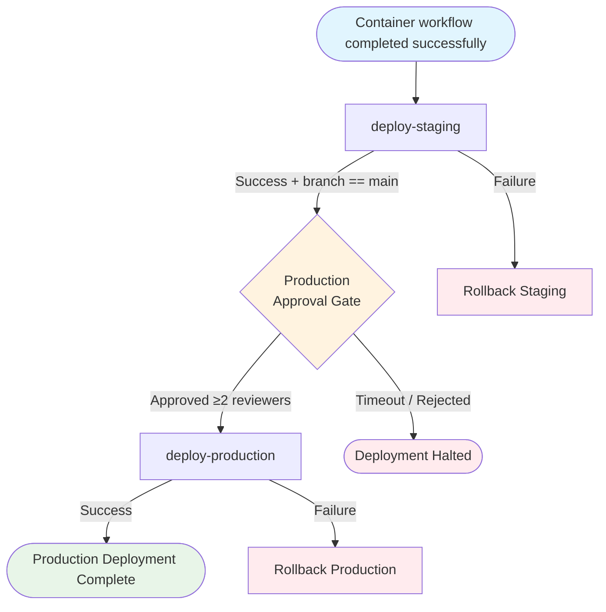

## Workflow Overview

**Purpose**: Deploy the validated and attested container image to AKS staging (all branches) and AKS production (main only, with required human approval).
**Trigger Events**: Successful completion of Container workflow (`workflow_run`); `workflow_dispatch`
**Target Environments**: AKS Staging, AKS Production
**Workflow File**: `.github/workflows/deploy.yml`
**Workflow Name**: `Deploy`
**Chain Position**: Link 3 of 3 — final stage; downstream of `Container`

---

## Execution Flow Diagram



---

## Jobs & Dependencies

| Job Name | Purpose | Dependencies | Execution Context | Timeout | Environment |
|---|---|---|---|---|---|
| `deploy-staging` | Deploy image to AKS staging; health-check; auto-rollback on failure | — (CI conclusion required) | `ubuntu-latest` | 15 min | `staging` |
| `deploy-production` | Deploy same image to AKS production; health-check; auto-rollback on failure | `deploy-staging` | `ubuntu-latest` | 20 min | `production` |

**Concurrency**: `deploy-${{ github.event.workflow_run.head_branch }}` — `cancel-in-progress: false` (CRITICAL: never cancel in-flight deployments).

---

## Requirements Matrix

### Functional Requirements

| ID | Requirement | Priority | Acceptance Criteria |
|---|---|---|---|
| REQ-001 | Deploy only when upstream Container workflow succeeded | High | Top-level `if: workflow_run.conclusion == 'success'` |
| REQ-002 | Image tag read from `deploy-metadata` artifact — never re-derived | High | `image-tag` file from Container run's `deploy-metadata` artifact |
| REQ-003 | Staging receives deployments from both `main` and `develop` | High | No branch restriction on `deploy-staging` |
| REQ-004 | Production deploys restricted to `main` branch only | High | `if: workflow_run.head_branch == 'main'` on `deploy-production` |
| REQ-005 | Production requires ≥2 required reviewers approval | High | GitHub Environment protection rules on `production` environment |
| REQ-006 | Staging rollout waits with 5-minute timeout | High | `kubectl rollout status --timeout=5m` |
| REQ-007 | Production rollout waits with 10-minute timeout | High | `kubectl rollout status --timeout=10m` |
| REQ-008 | Staging health check: 5 retries, 10s delay | High | `curl --retry 5 --retry-delay 10` on `STAGING_HEALTH_URL/actuator/health` |
| REQ-009 | Production health check: 10 retries, 15s delay | High | `curl --retry 10 --retry-delay 15` on `PRODUCTION_HEALTH_URL/actuator/health` |
| REQ-010 | Auto-rollback triggered only on failure | High | `if: failure()` guard on rollback steps |
| REQ-011 | Deployments never cancelled mid-flight | Critical | `cancel-in-progress: false` on concurrency block |
| REQ-012 | Same image deployed to staging and production | High | Both jobs read from same `deploy-metadata` artifact |

### Security Requirements

| ID | Requirement | Implementation Constraint |
|---|---|---|
| SEC-001 | Azure login via OIDC — no stored credentials | `azure/login@v2` with federated identity secrets |
| SEC-002 | Production environment requires ≥2 approvals | GitHub Environment protection rules (Settings → Environments → production) |
| SEC-003 | Production access restricted to `main` branch | `if: workflow_run.head_branch == 'main'` |
| SEC-004 | Image digest available for audit | `image-digest` file in `deploy-metadata` artifact |
| SEC-005 | `actions: read` required for cross-workflow artifact download | Scoped to each deployment job |

### Performance Requirements

| ID | Metric | Target | Measurement Method |
|---|---|---|---|
| PERF-001 | Staging deployment end-to-end | ≤ 15 min | Job timeout |
| PERF-002 | Production deployment end-to-end | ≤ 20 min | Job timeout |
| PERF-003 | Total pipeline (from push to prod) | ≤ 90 min (incl. approval wait) | GitHub Actions run duration |
| PERF-004 | Health check response time | < 30s per retry | `curl --retry-connrefused` |

---

## Input/Output Contracts

### Inputs

```yaml
# Upstream Trigger
trigger: workflow_run
workflows: ['Container']    # CRITICAL: must match container.yml name exactly
types: [completed]
branches: [main, develop]

# Consumed Artifact (from Container run)
deploy-metadata:
  files:
    - commit-sha     # e.g. abc1234def5678...
    - image-tag      # e.g. myregistry.azurecr.io/hello-java:abc1234
    - image-digest   # e.g. sha256:abcdef...
  run-id: github.event.workflow_run.id    # Cross-workflow download
  github-token: GITHUB_TOKEN
```

### Outputs

```yaml
# AKS Deployments
staging:
  namespace: staging
  deployment: vars.APP_NAME
  image: steps.meta.outputs.image   # From image-tag file

production:
  namespace: production
  deployment: vars.APP_NAME
  image: steps.meta.outputs.image   # Same image as staging

# GitHub Environment Deployments
staging-deployment: GitHub Deployments API entry
production-deployment: GitHub Deployments API entry
```

### Secrets & Variables

| Type | Name | Purpose | Scope |
|---|---|---|---|
| Secret | `AZURE_CLIENT_ID` | OIDC federated identity | Both jobs |
| Secret | `AZURE_TENANT_ID` | OIDC tenant | Both jobs |
| Secret | `AZURE_SUBSCRIPTION_ID` | Azure subscription | Both jobs |
| Variable | `AKS_CLUSTER_NAME_STAGING` | Staging AKS cluster name | `deploy-staging` |
| Variable | `AKS_RESOURCE_GROUP_STAGING` | Staging AKS resource group | `deploy-staging` |
| Variable | `AKS_CLUSTER_NAME_PROD` | Production AKS cluster name | `deploy-production` |
| Variable | `AKS_RESOURCE_GROUP_PROD` | Production AKS resource group | `deploy-production` |
| Variable | `APP_NAME` | Kubernetes Deployment name and container name | Both jobs |
| Variable | `STAGING_HEALTH_URL` | Base URL for staging health endpoint | `deploy-staging` |
| Variable | `PRODUCTION_HEALTH_URL` | Base URL for production health endpoint | `deploy-production` |
| Built-in | `GITHUB_TOKEN` | Cross-workflow artifact download | Both jobs |

---

## Execution Constraints

### Runtime Constraints

- **Max single-job timeout**: 20 min (`deploy-production`)
- **Concurrency group**: `deploy-${{ github.event.workflow_run.head_branch || github.ref }}`
- **Cancel policy**: `cancel-in-progress: false` — in-progress deployments must never be cancelled
- **Top-level condition**: `github.event.workflow_run.conclusion == 'success'` or `workflow_dispatch`

### Environmental Constraints

- **Runner**: `ubuntu-latest`
- **AKS Access**: `kubectl` via `azure/aks-set-context@v4`; kubeconfig scoped to cluster
- **Spring Boot Actuator**: Required on classpath for `/actuator/health` health check endpoint
- **PostgreSQL/DB**: Deployment assumes application handles schema migrations independently

### Permissions (Minimum Required)

| Job | Required Permissions |
|---|---|
| `deploy-staging` | `contents: read`, `id-token: write`, `actions: read` |
| `deploy-production` | `contents: read`, `id-token: write`, `actions: read` |

### GitHub Environment Protection Rules

| Environment | Required Reviewers | Wait Timer | Branch Restriction |
|---|---|---|---|
| `staging` | 0 (automated) | None | None |
| `production` | ≥ 2 required reviewers | Optional | `main` branch |

---

## Error Handling Strategy

| Error Type | Response | Recovery Action |
|---|---|---|
| Container workflow failed | Entire Deploy workflow skipped (top-level condition) | Fix Container workflow, re-push |
| `deploy-metadata` artifact not found | Job fails at artifact download | Verify Container run completed and artifact uploaded |
| Azure OIDC auth failure | Job fails at login step | Verify federated credentials configured in Azure AD |
| AKS context failure | Job fails; no `kubectl` commands run | Verify AKS cluster name/resource group variables |
| `kubectl set image` failure | Job fails; rollout not started | Check deployment name and container name match `APP_NAME` |
| Rollout timeout (5m staging / 10m prod) | Job fails; rollback triggered | Investigate pod events (`kubectl describe pod`) |
| Health check failure (all retries exhausted) | Job fails; rollback triggered | Investigate application startup logs |
| Rollback failure | Job fails with compound error | Manual intervention required; check pod state |
| Production approval timeout | `deploy-production` skipped | Reviewers must approve within environment wait timer |

---

## Quality Gates

| Gate | Criteria | Bypass Conditions |
|---|---|---|
| Upstream Container Success | Container workflow must conclude `success` | `workflow_dispatch` manual override |
| Staging Rollout | All pods healthy within 5 min | None — auto-rollback if fails |
| Staging Health Check | `/actuator/health` returns HTTP 200 within 5 retries | None — auto-rollback if fails |
| Production Approval | ≥ 2 reviewers approve | None — enforced by GitHub Environment rules |
| Branch Gate | Production job runs only for `main` branch | `workflow_dispatch` from `main` ref |
| Production Rollout | All pods healthy within 10 min | None — auto-rollback if fails |
| Production Health Check | `/actuator/health` returns HTTP 200 within 10 retries | None — auto-rollback if fails |

---

## Monitoring & Observability

### Key Metrics

- **Staging Deployment Frequency**: Expected per merge to `main`/`develop`
- **Production Deployment Frequency**: Expected per merge to `main` (after approval)
- **Rollback Rate**: Track frequency — high rate indicates stability issues
- **Health Check Response Time**: Monitor trends via retry counts

### Alerting

| Condition | Severity | Notification Target |
|---|---|---|
| Staging rollback triggered | High | Team notification (build failure) |
| Production rollback triggered | Critical | On-call team + management |
| Production approval pending | Info | Required reviewers (GitHub notification) |
| OIDC auth failure | Critical | Ops team (identity misconfiguration) |
| Deployment timeout | High | Ops team |

---

## Integration Points

### External Systems

| System | Integration Type | Data Exchange | SLA Requirements |
|---|---|---|---|
| Azure Kubernetes Service (AKS) | Write | `kubectl set image`, `rollout status`, `rollout undo` | < 5 min rollout |
| Azure Active Directory (OIDC) | Authentication | Short-lived JWT token | Pre-deployment |
| Spring Boot Actuator (`/actuator/health`) | Read (HTTP) | JSON health response | < 30s per check |
| GitHub Environments API | Read/Write | Approval gates, deployment events | Manual approval window |

### Dependent Workflows

| Workflow | Relationship | Trigger Mechanism |
|---|---|---|
| `Container` (`container.yml`) | Upstream trigger | `workflow_run: workflows: ['Container']` → this workflow |

---

## Compliance & Governance

### Audit Requirements

- **Deployment Events**: Recorded in GitHub Environments (staging + production)
- **Approval Log**: GitHub stores approver identity and timestamp for production
- **Image Traceability**: `image-digest` in `deploy-metadata` provides full provenance chain: commit SHA → image tag → digest → SLSA attestation
- **Rollback Events**: GitHub Actions run history preserves rollback executions

### Security Controls

- **No Stored Credentials**: Azure access exclusively via OIDC
- **Least Privilege OIDC**: Federated credentials scoped to specific branches (`main`/`develop`)
- **Immutable Image Tag**: SHA tag from `deploy-metadata` prevents image substitution
- **Production Gate**: Two-person rule enforced via GitHub Environment protection
- **Never Cancel In-Progress**: `cancel-in-progress: false` prevents partial rollouts

---

## Edge Cases & Exceptions

| Scenario | Expected Behavior | Validation Method |
|---|---|---|
| Rapid pushes to `main` | Only one deploy active per branch (concurrency); new push queued, not cancelled | Verify `cancel-in-progress: false` behavior |
| Production approval rejected | `deploy-production` skipped; staging remains on new version | Check GitHub Environments deployment log |
| AKS cluster node pressure during rollout | Rollout may timeout; rollback triggered | Monitor AKS node metrics |
| Health check endpoint not yet live (slow start) | Retries with `--retry-connrefused` absorb initial delay | Test with intentionally slow boot |
| `workflow_dispatch` on `develop` | `deploy-staging` runs; `deploy-production` skipped (branch gate) | Manual trigger test |
| Same image re-deployed (no-op) | Kubernetes accepts `set image` even if unchanged; health check passes | Re-trigger test |
| `/actuator/health` returns non-200 | Health check fails after all retries; rollback triggered | Simulate health check failure |
| Rollback fails (cluster unreachable) | Compound failure; manual intervention required | Alert escalation |

---

## Validation Criteria

- **VLD-001**: `workflows: ['Container']` in `on.workflow_run` must match `container.yml` `name:` exactly
- **VLD-002**: `cancel-in-progress: false` on concurrency block — never change
- **VLD-003**: `deploy-metadata` artifact downloaded with `run-id: ${{ github.event.workflow_run.id }}`
- **VLD-004**: Production job has `needs: [deploy-staging]`
- **VLD-005**: Production job has branch gate: `workflow_run.head_branch == 'main'`
- **VLD-006**: Both jobs use `if: failure()` (not `if: always()`) on rollback steps
- **VLD-007**: Production rollout timeout is ≥ staging timeout (10m vs 5m)
- **VLD-008**: Production health check retries are ≥ staging (10 vs 5)
- **VLD-009**: `environment: production` declared on `deploy-production` job
- **VLD-010**: `id-token: write` and `actions: read` permissions on both deployment jobs

---

## Change Management

### Update Process

1. **Specification Update**: Modify this document first
2. **Environment Rule Changes**: Update GitHub Settings → Environments for approval rule changes
3. **Review & Approval**: PR review by DevOps Team + Security Team (for production changes)
4. **Implementation**: Apply changes to `deploy.yml`
5. **Testing**: Push to `develop`, confirm staging deploy + health check; then test production path on `main`

### Version History

| Version | Date | Changes | Author |
|---|---|---|---|
| 1.0 | 2026-03-05 | Initial specification | DevOps Team |

---

## Related Specifications

- [spec-process-cicd-pr-validation.md](spec-process-cicd-pr-validation.md) — Pre-merge validation
- [spec-process-cicd-ci.md](spec-process-cicd-ci.md) — Build & test
- [spec-process-cicd-container.md](spec-process-cicd-container.md) — Upstream: Docker build & push
