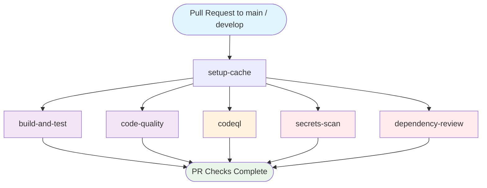

## Workflow Overview

**Purpose**: Validate all pull requests targeting `main` or `develop` by running quality, security, and coverage checks before merge.
**Trigger Events**: Pull request opened/synchronized/reopened targeting `main` or `develop`
**Target Environments**: PR sandbox (ephemeral, no deployment)
**Workflow File**: `.github/workflows/pr-validation.yml`
**Workflow Name (immutable)**: `PR Validation`
**Chain Position**: Standalone — no downstream `workflow_run` consumer

---

## Execution Flow Diagram



---

## Jobs & Dependencies

| Job Name | Purpose | Dependencies | Execution Context | Timeout |
|---|---|---|---|---|
| `setup-cache` | Pre-warm Maven dependency cache | — | `ubuntu-latest` | 10 min |
| `build-and-test` | Compile, unit test, JaCoCo coverage gate, publish results | `setup-cache` | `ubuntu-latest` | 20 min |
| `code-quality` | Checkstyle + SpotBugs static analysis | `setup-cache` | `ubuntu-latest` | 10 min |
| `codeql` | CodeQL SAST scan (non-fork PRs only) | `setup-cache` | `ubuntu-latest` | 30 min |
| `secrets-scan` | Gitleaks full-history secrets detection | — (fully parallel) | `ubuntu-latest` | 5 min |
| `dependency-review` | Check new deps for CVEs and disallowed licenses | — (fully parallel) | `ubuntu-latest` | 10 min |

**Concurrency**: One run per PR number; newer runs cancel older runs (`cancel-in-progress: true`).

---

## Requirements Matrix

### Functional Requirements

| ID | Requirement | Priority | Acceptance Criteria |
|---|---|---|---|
| REQ-001 | Maven dependency cache pre-warmed before parallel test/quality jobs | High | `setup-cache` completes before `build-and-test` and `code-quality` start |
| REQ-002 | Unit tests compile and pass on every PR | High | Zero test failures; `mvn test` exits 0 |
| REQ-003 | Line coverage ≥ 80% enforced as hard gate | High | JaCoCo `check` goal exits non-zero when below threshold; build fails |
| REQ-004 | Test results published to GitHub Checks UI | Medium | XML reports from `target/surefire-reports/` attached to PR checks |
| REQ-005 | Checkstyle: zero violations | High | `checkstyle:check` exits 0 |
| REQ-006 | SpotBugs: zero violations | High | `spotbugs:check` exits 0 |
| REQ-007 | CodeQL SAST runs on non-fork PRs only | Medium | Skipped with `if: github.event.pull_request.head.repo.full_name == github.repository` |
| REQ-008 | Full git history available for Gitleaks | High | `fetch-depth: 0` on `secrets-scan` checkout |
| REQ-009 | Dependency review comments on PR on failure | Medium | `comment-summary-in-pr: on-failure` |
| REQ-010 | GPL-2.0 and AGPL-3.0 licenses blocked | High | `deny-licenses: GPL-2.0, AGPL-3.0` causes build failure |

### Security Requirements

| ID | Requirement | Implementation Constraint |
|---|---|---|
| SEC-001 | No credentials stored in repo | `persist-credentials: false` on all checkouts |
| SEC-002 | Gitleaks scans full commit history | `fetch-depth: 0` required for all history |
| SEC-003 | CodeQL results visible in Security tab | `security-events: write` permission scoped to `codeql` job only |
| SEC-004 | High-severity CVEs in new dependencies block merge | `fail-on-severity: high` on dependency-review |
| SEC-005 | Gitleaks license handled via secret | `GITLEAKS_LICENSE` secret (required for private repos) |

### Performance Requirements

| ID | Metric | Target | Measurement Method |
|---|---|---|---|
| PERF-001 | Total wall-clock time | ≤ 20 min | GitHub Actions run duration |
| PERF-002 | `setup-cache` duration | ≤ 10 min | Individual job runtime |
| PERF-003 | Maven cache hit rate | > 80% | Cache restore key match |

---

## Input/Output Contracts

### Inputs

```yaml
# GitHub Events
trigger: pull_request
branches: [main, develop]

# Pull Request Context
gh.event.pull_request.number: int     # Used in concurrency group
gh.event.pull_request.head.repo.full_name: string  # Fork detection for CodeQL
```

### Outputs

```yaml
# Artifacts (uploaded per PR run)
pr-test-reports: directory     # Surefire XML reports — retention: 5 days
pr-coverage-report: directory  # JaCoCo HTML report — retention: 5 days
quality-reports: files         # checkstyle-result.xml + spotbugsXml.xml — retention: 7 days

# GitHub Checks
test-results-check: GitHub Checks entry with pass/fail counts
codeql-alerts: GitHub Security tab (advisory)
```

### Secrets & Variables

| Type | Name | Purpose | Scope |
|---|---|---|---|
| Secret | `GITLEAKS_LICENSE` | Authenticate Gitleaks for private repo scans | `secrets-scan` job |
| Built-in | `GITHUB_TOKEN` | Publish test results to Checks API | `build-and-test` job |

---

## Execution Constraints

### Runtime Constraints

- **Max single-job timeout**: 30 min (`codeql`)
- **Concurrency**: Scoped to `pr-${{ github.event.pull_request.number }}` — one active run per PR
- **Cancel policy**: `cancel-in-progress: true` — older runs cancelled on new push

### Environmental Constraints

- **Runner**: `ubuntu-latest` for all jobs
- **Java**: JDK 21 (Temurin distribution) for compilation and analysis
- **Compilation target**: Java 11 (`maven.compiler.source/target`)
- **Fork restriction**: `codeql` skipped on fork PRs (no `security-events: write` access)

### Permissions (Minimum Required)

| Job | Required Permissions |
|---|---|
| `setup-cache` | `contents: read` |
| `build-and-test` | `contents: read`, `checks: write` |
| `code-quality` | `contents: read` |
| `codeql` | `contents: read`, `security-events: write`, `actions: read` |
| `secrets-scan` | `contents: read` |
| `dependency-review` | `contents: read`, `pull-requests: write` |

---

## Error Handling Strategy

| Error Type | Response | Recovery Action |
|---|---|---|
| Test failure | Build fails; Surefire XML still uploaded (`if: always()`) | Fix failing tests before merge |
| Coverage below 80% | `jacoco:check` exits non-zero; fails `build-and-test` | Increase test coverage |
| Checkstyle violation | `checkstyle:check` exits non-zero; fails `code-quality` | Fix formatting/style violations |
| SpotBugs violation | `spotbugs:check` exits non-zero; fails `code-quality` | Fix bug patterns |
| CodeQL alert | Advisory only; does not block merge | Review in Security tab |
| Secret detected | `gitleaks-action` exits non-zero; fails `secrets-scan` | Rotate secret, clean history |
| GPL/AGPL license | Dependency review fails + PR comment added | Replace with compatible dependency |
| High CVE in new dep | Dependency review fails | Upgrade or replace dependency |

---

## Quality Gates

| Gate | Criteria | Bypass Conditions |
|---|---|---|
| Unit Tests | All tests pass | None |
| Line Coverage | ≥ 80% line coverage (JaCoCo) | None — hard build gate |
| Checkstyle | Zero violations | None |
| SpotBugs | Zero violations | None |
| Secrets Detection | No secrets in commit history | None |
| Dependency Licenses | No GPL-2.0 or AGPL-3.0 | None |
| Dependency CVEs | No high/critical CVEs in new deps | None |
| CodeQL SAST | Advisory (non-blocking) | Forks (skipped entirely) |

---

## Monitoring & Observability

### Key Metrics

- **Success Rate**: Target ≥ 95% of PRs pass on first run
- **Execution Time**: Target ≤ 20 min wall-clock
- **Cache Hit Rate**: Monitor via Actions cache UI

### Alerting

| Condition | Severity | Notification Target |
|---|---|---|
| Secret detected in PR | Critical | PR author + repo admins (Gitleaks) |
| GPL/AGPL license introduced | High | PR comment (auto-posted) |
| High CVE in new dependency | High | PR comment (auto-posted) |

---

## Integration Points

### External Systems

| System | Integration Type | Data Exchange | SLA Requirements |
|---|---|---|---|
| GitHub Checks API | Write | Test result XML → Checks UI | Synchronous during run |
| GitHub Security Tab | Write (SARIF) | CodeQL alerts | Within run completion |
| Gitleaks License Server | Auth | License key validation | Pre-run |

### Dependent Workflows

| Workflow | Relationship | Trigger Mechanism |
|---|---|---|
| None | Standalone — no downstream consumers | N/A |

---

## Compliance & Governance

### Audit Requirements

- **Execution Logs**: GitHub Actions log retention (per org policy)
- **Approval Gates**: None (automated gate only)
- **Artifact Retention**: Test reports 5 days; quality reports 7 days

### Security Controls

- **Access Control**: `persist-credentials: false` on all checkouts
- **Fork Safety**: CodeQL skipped on forks; no secret exposure
- **License Compliance**: GPL-2.0 and AGPL-3.0 automatically blocked

---

## Edge Cases & Exceptions

| Scenario | Expected Behavior | Validation Method |
|---|---|---|
| Fork PR submitted | `codeql` job skipped; all other gates run | Check job skip condition in run history |
| PR with no Java changes | All jobs still run (no path filters) | Observe run on docs-only PRs |
| Maven cache miss | `setup-cache` succeeds but is slower; subsequent jobs unaffected | Job runtime metrics |
| Gitleaks without license in private repo | `secrets-scan` fails | Verify `GITLEAKS_LICENSE` secret set |
| New dependency with no license | Dependency review fails (treated as unknown) | PR comment indicating unknown license |

---

## Validation Criteria

- **VLD-001**: `setup-cache` must complete before `build-and-test` and `code-quality` start
- **VLD-002**: `build-and-test` must fail when line coverage < 80%
- **VLD-003**: `code-quality` must fail on any Checkstyle or SpotBugs violation
- **VLD-004**: `secrets-scan` must use `fetch-depth: 0` (full history)
- **VLD-005**: `codeql` must not run on fork PRs
- **VLD-006**: Artifacts must be uploaded even when tests fail (`if: always()`)
- **VLD-007**: `dependency-review` must post to PR on failure
- **VLD-008**: `cancel-in-progress: true` — only one run active per PR number

---

## Change Management

### Update Process

1. **Specification Update**: Modify this document first
2. **Review & Approval**: PR review by DevOps Team
3. **Implementation**: Apply changes to `pr-validation.yml`
4. **Testing**: Open a test PR, verify all 6 jobs behave as specified
5. **Deployment**: Merge to `main`; effective immediately on next PR

### Version History

| Version | Date | Changes | Author |
|---|---|---|---|
| 1.0 | 2026-03-05 | Initial specification | DevOps Team |

---

## Related Specifications

- [spec-process-cicd-ci.md](spec-process-cicd-ci.md) — Downstream CI workflow (runs after merge)
- [spec-process-cicd-container.md](spec-process-cicd-container.md) — Container build workflow
- [spec-process-cicd-deploy.md](spec-process-cicd-deploy.md) — Deployment workflow
